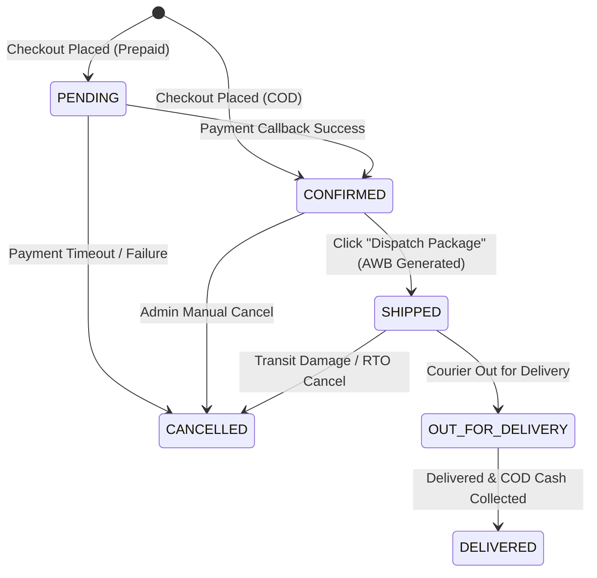

# Standard Order Fulfillment & Dispatch Workflow

This document explains the D2C industry-standard order fulfillment workflow designed for MadhurGram, explaining state transitions, automated checks, and how it prevents Return to Origin (RTO) shipping losses.

---

## 1. Fulfillment Pipeline Stages

Every order at MadhurGram flows through a structured state machine:

1. **`PENDING` (Prepaid only):** Customer placed order but payment validation is pending.
2. **`CONFIRMED` (Warehouse Queue):** Order is confirmed and sits in the packing queue.
   * *For COD:* Confirmed immediately upon purchase.
   * *For Prepaid:* Confirmed automatically upon online payment callback success.
3. **`SHIPPED` (Dispatched):** Warehouse team wrapped the package, clicked **"Dispatch Package"** on the dashboard. The system connected to the Delhivery/Logistics API, booked the pickup, obtained the AWB waybill tracking number, and dispatched the shipped notification to the customer.
4. **`OUT_FOR_DELIVERY`:** The local courier office out-for-delivery agent is carrying the box.
5. **`DELIVERED`:** Parcel successfully delivered. Cash collected (if COD).

---

## 2. Why Manual Dispatch (Instead of Auto-Shipping)?

Auto-booking shipping labels within milliseconds of purchase creates several high-risk problems in real retail environments:

### A. Preventing COD Return-To-Origin (RTO) Losses
* **Problem:** COD orders in India have a high cancellation rate (fake numbers, incorrect address formats, change of mind). Auto-shipping books couriers immediately, and carriers charge shipping fees even if the customer rejects it at their doorstep.
* **Solution:** Orders remain in the `CONFIRMED` state. The store admin can call/WhatsApp the customer to verify the phone and address, and only click **"Dispatch Package"** once verified.

### B. Warehouse Quality Check & Stock Sync
* **Problem:** Auto-shipping books pickups before the warehouse check. If Ghee jars are leaked, or mixed pickles are out-of-stock, canceling is difficult once logistics has generated the AWB.
* **Solution:** Manual dispatch ensures courier booking only occurs when the box is packaged and physically ready for handoff.

---

## 3. Maintenance Guidelines

* **Fulfillment API Endpoint:** POST `/api/orders/{id}/status?status=SHIPPED` maps directly to `logisticsService.scheduleOrderPickup()`.
* **Strategy Selection:** Active logistics strategy is controlled dynamically in `application.properties` via `madhurgram.logistics.provider` (values: `DELHIVERY`, `SHIPROCKET`, etc.).
