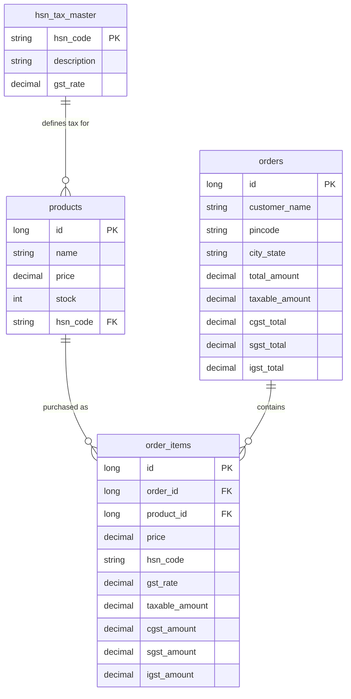

# Dynamic India GST Tax-Rule Engine (CGST/SGST/IGST)

This document provides a comprehensive guide to the design, database schema, math logic, and billing calculations used by MadhurGram's Indian GST compliance system.

---

## 1. Why is this necessary?
Under the **Indian Goods and Services Tax (GST)** system, e-commerce transactions are governed by "Destination-Based Consumption Tax" rules (Section 24 of the CGST Act):
* **Intra-State Supply (State of origin = State of delivery):** Since MadhurGram's shipping warehouse is in **Uttar Pradesh (Gopiganj)**, any order shipped to a customer in Uttar Pradesh incurs **CGST** (Central GST) and **SGST** (State GST), split 50/50 from the total tax slab.
* **Inter-State Supply (State of origin != State of delivery):** Any order shipped to an address outside Uttar Pradesh (e.g., Maharashtra, Delhi, Karnataka) incurs **IGST** (Integrated GST), taking up 100% of the tax slab.
* **HSN Codes (Harmonized System of Nomenclature):** To satisfy statutory tax audits, every invoice must map products to their official government HSN classification codes (e.g., `0405` for Ghee, `1701` for Jaggery/Sugar).

---

## 2. Mathematical Calculation Model
Since all prices displayed on the MadhurGram store catalog are **GST-inclusive**, we perform a reverse calculation (Tax-Inclusive Breakdown) to determine the base taxable amount:

### Formula
1. **Taxable Base Value (Taxable Amount):**
   $$\text{Taxable Base} = \frac{\text{Total Item Price}}{1 + \left(\frac{\text{GST Rate}}{100}\right)}$$
2. **Total GST Amount:**
   $$\text{Total GST} = \text{Total Item Price} - \text{Taxable Base}$$
3. **Tax Splits:**
   * **If Intra-State (UP):**
     $$\text{CGST} = \text{SGST} = \frac{\text{Total GST}}{2}$$
     $$\text{IGST} = 0$$
   * **If Inter-State (Outside UP):**
     $$\text{IGST} = \text{Total GST}$$
     $$\text{CGST} = \text{SGST} = 0$$

All calculations are executed in the Java backend using `BigDecimal` with `RoundingMode.HALF_UP` to prevent rounding errors.

---

## 3. Database Schema



---

## 4. Operational Walkthrough Examples

### Example 1: Ghee order shipped to Noida, UP (Intra-State)
* **Product:** MadhurGram A2 Ghee 500ml
* **Quantity:** 1
* **Inclusive Price:** ₹649.00
* **HSN Category:** `0405` (Animal Fats & Ghee, 12% GST)
* **State of Supply:** Uttar Pradesh
* **Calculations:**
  * $\text{Taxable Base} = \frac{649.00}{1 + 0.12} = \frac{649.00}{1.12} = \text{₹579.46}$
  * $\text{Total GST} = 649.00 - 579.46 = \text{₹69.54}$
  * $\text{CGST} = \frac{69.54}{2} = \text{₹34.77}$
  * $\text{SGST} = \frac{69.54}{2} = \text{₹34.77}$
  * $\text{IGST} = 0.00$
* **Invoice Output:**
  * Base Price: ₹579.46
  * CGST (6%): ₹34.77
  * SGST (6%): ₹34.77
  * Grand Total: ₹649.00

### Example 2: Mustard Oil order shipped to Mumbai, MH (Inter-State)
* **Product:** Wood-Pressed Mustard Oil 1L
* **Quantity:** 2
* **Inclusive Price:** ₹299.00 per unit (Total: ₹598.00)
* **HSN Category:** `1512` (Vegetable & Mustard Oils, 5% GST)
* **State of Supply:** Maharashtra
* **Calculations:**
  * $\text{Taxable Base} = \frac{598.00}{1 + 0.05} = \frac{598.00}{1.05} = \text{₹569.52}$
  * $\text{Total GST} = 598.00 - 569.52 = \text{₹28.48}$
  * $\text{IGST} = \text{₹28.48}$
  * $\text{CGST} = \text{SGST} = 0.00$
* **Invoice Output:**
  * Base Price: ₹569.52
  * IGST (5%): ₹28.48
  * Grand Total: ₹598.00

---

## 5. How to Maintain Tax Slabs (Future Rates Change)
If the government updates a tax slab or you add a new category, **no code needs to be modified**:

### Option A: Mapping Products to HSN Codes (Admin Catalog UI)
1. Go to the Admin dashboard: `/admin/products`.
2. Click **Edit Product** on an existing item or click **Add Product**.
3. Under the category field, locate the **HSN / GST Code dropdown** selector.
4. Select the matching HSN code (e.g. `0405 - Ghee (12% GST)`) and click **Save Product**.
5. The frontend table and catalog immediately reflect the updated HSN linkage, and the backend automatically invalidates product/analytics cache keys so customers see the updated tax parameters instantly.

### Option B: Modifying GST Rates themselves (Tax Settings UI)
If the government changes a tax rate (e.g. Ghee tax slab changes from 12% to 18%):
1. Go to the Admin dashboard and navigate to the **Tax Settings** sidebar link (`/admin/tax-settings`).
2. Locate the HSN code (e.g., `0405`).
3. Click the **Edit** action icon on that slab row.
4. Change the **GST Percentage (%)** input field value to `18.0` and click **Save Slab**.
5. The database is updated, cache is evicted, and all products mapped to HSN `0405` instantly compute GST using the new 18% rate during checkout.

### Option C: Via Direct SQL Updates
1. Open your database administration client.
2. Execute a simple `UPDATE` query on the `hsn_tax_master` table.
   * *Example:* Changing Ghee GST to 18%:
     ```sql
     UPDATE hsn_tax_master SET gst_rate = 18.00 WHERE hsn_code = '0405';
     ```
3. The next checkout transaction automatically reads the updated rate and uses it in calculations.

---

## 6. Migration & Seeding Scripts
A complete backup and deployment migration SQL script has been created under:
* **[schema_and_seed_tax.sql](file:///d:/MadhurGram/product-service/src/main/resources/schema_and_seed_tax.sql)**

This script contains the precise queries for:
* Creating the schema tables (`hsn_tax_master`).
* Modifying existing tables (`products`, `orders`, `order_items`) to add compliant columns.
* Seeding real tax rates and category mappings for all default inventory items.

---

## 7. How to Find Indian HSN Codes in the Future
If you launch a new category of products (e.g., Organic Honey, Spices, Herbal Tea), you can easily lookup their standard HSN tax classification codes using these official resources:
1. **Official GST Search Tool:**
   * Visit: [Government GST Portal HSN Search](https://services.gst.gov.in/services/searchhsn)
   * Enter the product name (e.g. "Honey" or "Turmeric") to get the 4-digit or 6-digit HSN code.
2. **Online Tax Databases:**
   * Visit [ClearTax GST HSN Finder](https://cleartax.in/s/hsn-code-finder) or Taxmann to search HSN rates and search by keywords.
3. **Public Search Engines:**
   * Search google for `"Product name" HSN code GST rate India` (e.g., `"Honey HSN code GST rate India"` resolves to HSN `0409` and 5% GST).
4. Once you obtain the code, add it to the `/admin/tax-settings` screen, then map it to the corresponding product in the Catalog form!
