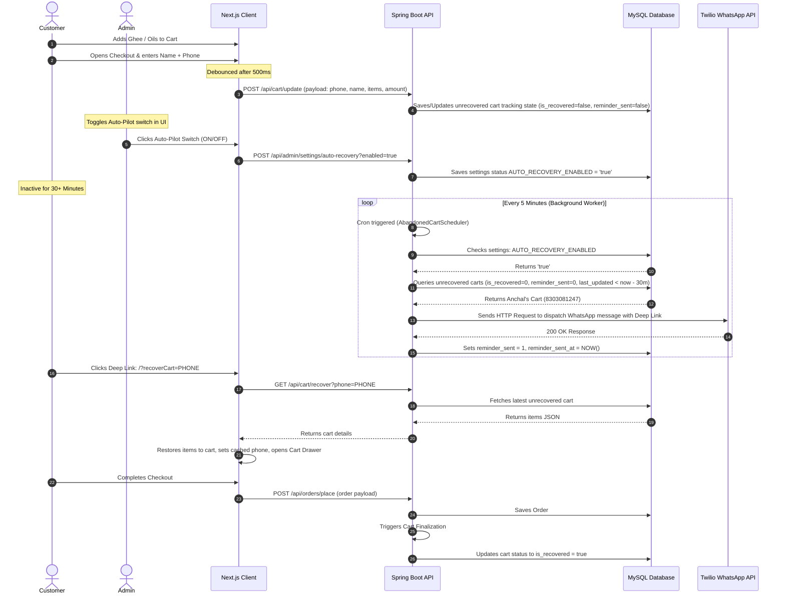

# Feature Documentation: Abandoned Cart Recovery (Sales Engine & Auto-Pilot)

## 1. Overview
The **Abandoned Cart Recovery** system targets cart abandonment (which accounts for ~70% of lost e-commerce checkouts). The system stores cart states reactively as customers proceed through checkout and provides two modes of recovery:
1. **Manual Recovery**: Admin views abandoned carts and clicks a button to dispatch WhatsApp reminders manually.
2. **Auto-Pilot Recovery**: An automated background scheduler periodically checks inactive carts and dispatches automated WhatsApp reminders using Twilio.
A **Master Toggle Switch** in the Admin UI gives business owners absolute control to turn the Auto-Pilot recovery engine **ON** or **OFF** at will (for example, during holiday festivals to maximize margin conversions).

---

## 2. System Architecture & Flow



---

## 3. Database Schema

### Table 1: `abandoned_carts`
| Column Name | SQL Type | JPA Attribute | Description |
| :--- | :--- | :--- | :--- |
| `id` | `BIGINT` (Primary Key, Auto-Increment) | `Long id` | Unique identifier for the cart tracking session. |
| `phone_number` | `VARCHAR(15)` (Not Null) | `String phoneNumber` | Customer's primary identity (10-digit mobile). |
| `customer_name` | `VARCHAR(100)` (Nullable) | `String customerName` | Customer's name, if provided in the checkout field. |
| `cart_items_json` | `TEXT` (Not Null) | `String cartItemsJson` | Serialized JSON array of items in the cart. |
| `total_amount` | `DECIMAL(10,2)` (Not Null) | `BigDecimal totalAmount` | Total order amount at the time of sync. |
| `last_updated` | `DATETIME` (Not Null) | `LocalDateTime lastUpdated` | Timestamp of the last cart update or sync. |
| `is_recovered` | `BIT` (Not Null, Default 0) | `boolean isRecovered` | Flag set to `true` once the customer places the order. |
| `reminder_sent` | `BIT` (Not Null, Default 0) | `boolean reminderSent` | Flag indicating whether the auto-pilot system sent a WhatsApp reminder. |
| `reminder_sent_at` | `DATETIME` (Nullable) | `LocalDateTime reminderSentAt` | Timestamp when the automated reminder was sent. |

### Table 2: `system_settings`
| Column Name | SQL Type | JPA Attribute | Description |
| :--- | :--- | :--- | :--- |
| `setting_key` | `VARCHAR(100)` (Primary Key) | `String settingKey` | Configuration setting lookup key. |
| `setting_value` | `TEXT` (Not Null) | `String settingValue` | Stored configuration setting value string. |
| `description` | `VARCHAR(255)` (Nullable) | `String description` | Developer/Admin note about the setting. |

---

## 4. API Specification

### A. Auto-Pilot Settings Toggle
- **Endpoint**: `/api/admin/settings/auto-recovery`
- **Authentication**: Required (`Bearer <JWT_TOKEN>`)
- **GET Request**: Returns the current status of the engine:
  - **Response (`200 OK`)**: `{"enabled": true}`
- **POST Request**: Updates the toggle state in DB:
  - **Parameters**: `enabled=true` (or `false`)
  - **Response (`200 OK`)**: `{"enabled": true}`

### B. Public Cart Synchronization
- **Endpoint**: `/api/cart/update`
- **Method**: `POST`
- **Authentication**: None (Public)
- **Request Payload (`application/json`)**:
  ```json
  {
    "phoneNumber": "8303081247",
    "customerName": "Anchal",
    "cartItemsJson": "[{\"id\":1,\"name\":\"Pure Shuddh Cow Ghee\",\"price\":998,\"volume\":\"1L\",\"imageUrl\":\"/ghee.png\",\"quantity\":1}]",
    "totalAmount": 998.00
  }
  ```

---

## 5. Background Task Scheduling (Auto-Pilot)
1. **EnableScheduling**: Activated in [ProductServiceApplication.java](file:///d:/MadhurGram/product-service/src/main/java/com/madhurgram/productservice/ProductServiceApplication.java) via `@EnableScheduling`.
2. **Cron Job ([AbandonedCartScheduler.java](file:///d:/MadhurGram/product-service/src/main/java/com/madhurgram/productservice/cart/scheduler/AbandonedCartScheduler.java))**: Runs every 5 minutes (`fixedRate = 300000`).
3. **Execution Steps**:
   - Queries `AUTO_RECOVERY_ENABLED` in `system_settings`. If `false` or absent, stops immediately.
   - Computes cutoff time `LocalDateTime.now().minusMinutes(30)`.
   - Fetches unrecovered, unsent abandoned carts older than 30 minutes from DB.
   - Iterates through carts, generates templates, and calls [TwilioService](file:///d:/MadhurGram/product-service/src/main/java/com/madhurgram/productservice/cart/service/TwilioService.java) to send the message.
   - Sets `reminder_sent = true`, `reminder_sent_at = NOW()`, and commits changes to MySQL.

---

## 6. Admin Panel Controls
The console dashboard `/admin/abandoned-carts` provides full visibility:
- **Master Switch**: Toggles the background scheduler ON or OFF dynamically.
- **Pipeline Stage Badges**: Displays order status:
  - `RECOVERED` (green): Successfully converted.
  - `AUTO REMINDED` (blue): WhatsApp dispatch executed.
  - `PENDING` (yellow): Still waiting in queue (inactivity <30 mins).

---

## 7. Auto-Pilot Toggle Button Guide (How to Use)
The master switch controls the automated background marketing dispatch and manages business messaging costs:

### A. Auto-Pilot OFF State (Default/Margin Protection)
- **Visuals**: The toggle button displays as gray (`bg-gray-800`) and is pushed to the left, showing status label **`Off`**.
- **Business Behavior**: 
  - Background automated scheduling is **PAUSED**. No WhatsApp messages are sent automatically.
  - Recommended for regular days to save on Twilio message fees or preserve margins against automatic discount offers.
  - Admins can still review the abandoned cart list on the dashboard and click the manual **`WhatsApp Reminder`** button to send message reminders selectively.

### B. Auto-Pilot ACTIVE State (Automated Campaigns)
- **Visuals**: The toggle button glows gold (`bg-[#D4AF37]`), slides to the right, and displays status label **`Active`** (in glowing green 🟢).
- **Business Behavior**: 
  - Background automated scheduler is **ACTIVE** and runs every 5 minutes.
  - Any customer leaving checkout after entering their phone number will automatically receive a WhatsApp message 30 minutes later containing their exact recovered cart deep link and coupon.
  - Highly recommended during festive seasons or promotional weekends to capture passive checkouts automatically at scale.

---

## 8. Developer Troubleshooting Notes & Gotchas

### A. Twilio Mock Mode (Safety Feature)
- **Problem**: When testing locally, you may not want to spend actual money on SMS/WhatsApp API charges, or you might not have active Twilio credentials configured.
- **Solution**: The system implements an auto-fallback **Mock Mode**.
  - If your `application.properties` (or environment variables) contain dummy/mock Twilio SIDs (e.g., starting with `ACmock`), the `TwilioService` will automatically intercept the dispatch.
  - It will **not** attempt external API calls. Instead, it will output a beautiful mock success log directly in the Spring console (`[MOCK TWILIO WHATSAPP DISPATCH] Successfully triggered in DEV mode.`), detailing the sender, receiver, and message body.
  - To enable actual dispatches, configure active production credentials in your properties files:
    ```properties
    twilio.account-sid=YOUR_LIVE_ACCOUNT_SID
    twilio.auth-token=YOUR_LIVE_AUTH_TOKEN
    twilio.from-number=YOUR_LIVE_WHATSAPP_NUMBER
    ```

### B. The "Vanishing Record" Lifecycle Bug
- **Problem**: During early testing, when Auto-Pilot triggered, the target cart record immediately disappeared from the admin list instead of showing the `AUTO REMINDED` badge.
- **Root Cause**: The JPA entity `AbandonedCart` initially used database-level lifecycle annotations:
  ```java
  @PrePersist
  @PreUpdate
  protected void onUpdate() {
      this.lastUpdated = LocalDateTime.now();
  }
  ```
  When the background scheduler updated only the status flags (`reminderSent = true` or `isRecovered = true`), Hibernate triggered the `@PreUpdate` listener. This inadvertently bumped `lastUpdated` to `now()`, making the record appear brand new (0 minutes inactive). As a result, the admin dashboard (which filters for inactive carts older than 30 minutes) filtered it out.
- **Resolution**: Removed database lifecycle annotations from the entity class. Timestamps are now managed strictly at the service layer during actual user-driven cart content updates (`updateCart`), preventing status-only backend updates from falsifying client inactivity timers.


