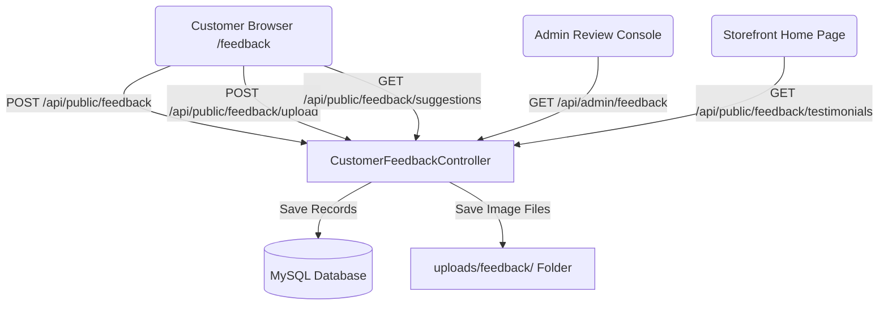

# 💬 Smart Customer Feedback System with Photo Uploads & Testimonials

This feature implements a customer feedback pipeline featuring a visual emoji selector, contextual suggestion chips matching to client orders, photo uploads of product packaging/bottles, storefront home testimonials showcases, and an administrative console showing sentiment distributions.

---

## 🏗️ Technical Architecture & Directory Structure



### Files Created/Modified

#### Backend (Spring Boot - Port 8080)
* **JPA Entity**: [CustomerFeedback.java](file:///d:/MadhurGram/product-service/src/main/java/com/madhurgram/productservice/feedback/entity/CustomerFeedback.java)
* **Repository**: [CustomerFeedbackRepository.java](file:///d:/MadhurGram/product-service/src/main/java/com/madhurgram/productservice/feedback/repository/CustomerFeedbackRepository.java)
* **Controller**: [CustomerFeedbackController.java](file:///d:/MadhurGram/product-service/src/main/java/com/madhurgram/productservice/feedback/controller/CustomerFeedbackController.java)
* **MVC Configuration**: [WebMvcConfig.java](file:///d:/MadhurGram/product-service/src/main/java/com/madhurgram/productservice/config/WebMvcConfig.java) (Modified to map static uploads)
* **Security Rules**: [SecurityConfig.java](file:///d:/MadhurGram/product-service/src/main/java/com/madhurgram/productservice/security/SecurityConfig.java) (Modified to permit public submission paths)
* **Notification Templates**: [OrderNotificationService.java](file:///d:/MadhurGram/product-service/src/main/java/com/madhurgram/productservice/order/service/OrderNotificationService.java) (Modified to append dynamic orderIds to feedback messages)

#### Frontend (Next.js - Port 3000)
* **Custom React Hook**: [useAdminFeedback.ts](file:///c:/Users/victus/madhurgram-frontend/src/hooks/useAdminFeedback.ts)
* **Customer Review Form Page**: [page.tsx](file:///c:/Users/victus/madhurgram-frontend/src/app/feedback/page.tsx)
* **Admin Review Console Dashboard**: [page.tsx](file:///c:/Users/victus/madhurgram-frontend/src/app/admin/feedback/page.tsx)
* **Storefront Testimonials Section**: [TestimonialsSection.tsx](file:///c:/Users/victus/madhurgram-frontend/src/components/features/feedback/TestimonialsSection.tsx)
* **Admin Navigation menu**: [AdminSidebar.tsx](file:///c:/Users/victus/madhurgram-frontend/src/components/common/AdminSidebar.tsx) (Modified to link reviews page)
* **Storefront Homepage Layout**: [page.tsx](file:///c:/Users/victus/madhurgram-frontend/src/app/page.tsx) (Modified to mount reviews)

---

## 🗄️ Database Schema Mapping

### Table: `customer_feedbacks`
| Column Name | Data Type | Constraints | Description |
| :--- | :--- | :--- | :--- |
| `id` | `BIGINT` | PRIMARY KEY, AUTO_INCREMENT | Auto-generated review identifier. |
| `order_id` | `BIGINT` | NULLABLE | Maps feedback to a specific order ID for context. |
| `customer_name` | `VARCHAR(150)` | NOT NULL | Customer name who wrote the review. |
| `sentiment` | `VARCHAR(50)` | NOT NULL | Sentiment categorizations: `LOVED_IT`, `HAPPY`, `NEUTRAL`, `SAD`, `ANGRY`. |
| `rating` | `INT` | NOT NULL | Stars given (scale of 1 to 5). |
| `feedback_text` | `VARCHAR(1000)` | NULLABLE | Detailed written comment review. |
| `selected_chips` | `VARCHAR(1000)` | NULLABLE | Comma-separated quick selection suggestion chips. |
| `product_image_url` | `VARCHAR(1000)` | NULLABLE | HTTP URL pointing to user's uploaded bottle/packaging image. |
| `created_at` | `TIMESTAMP` | NOT NULL | Record creation date and time. |

---

## 🔌 REST APIs & Endpoints

### 1. Submit Customer Feedback
* **URL**: `POST /api/public/feedback`
* **Access**: Public
* **Payload**:
```json
{
  "orderId": 28,
  "customerName": "Neeraj Patel",
  "sentiment": "LOVED_IT",
  "rating": 5,
  "feedbackText": "Desi ghee ki khushboo aur daanedar texture sach mein asardaar hai!",
  "selectedChips": "Desi Ghee ka swad sach mein lajawab aur shuddh hai! 💛,Packaging bohot surakshit aur clean thi.",
  "productImageUrl": "http://localhost:8080/uploads/feedback/abcd-1234-uuid.jpg"
}
```

### 2. Upload Customer Product/Bottle Photo
* **URL**: `POST /api/public/feedback/upload`
* **Access**: Public
* **Request Type**: `multipart/form-data`
* **Response**:
```json
{
  "url": "http://localhost:8080/uploads/feedback/uuid-filename.png"
}
```

### 3. Fetch Contextual Review Suggestion Chips
* **URL**: `GET /api/public/feedback/suggestions?orderId={id}`
* **Access**: Public
* **Mechanism**: Inspects ordered items matching the ID. Returns products-specific suggestion text chips (such as Desi Ghee reviews or Mithai reviews) alongside generic delivery suggestions.

### 4. Fetch Positive Testimonials for Storefront
* **URL**: `GET /api/public/feedback/testimonials`
* **Access**: Public
* **Response**: Returns up to 8 of the latest positive customer feedbacks (rating >= 4) with their comments, ratings, emojis, names, and uploaded packaging images.

### 5. Admin Review Console Data Fetch
* **URL**: `GET /api/admin/feedback`
* **Access**: Authenticated (Admin role)
* **Response**: List of all feedbacks ordered by creation timestamp descending.

---

## ⚙️ Static Image Upload Resource Mapping

To serve user-uploaded images dynamically without losing files on server builds, Spring MVC mappings are overridden inside `WebMvcConfig.java`:

```java
@Override
public void addResourceHandlers(ResourceHandlerRegistry registry) {
    registry.addResourceHandler("/uploads/**")
            .addResourceLocations("file:uploads/");
}
```
* **Storage Location**: Uploads are saved into an external `uploads/feedback` folder inside the workspace root.
* **Access URL**: Accessible via `http://localhost:8080/uploads/feedback/{filename}`.

---

## 🎨 Frontend UI Highlights

### 1. Tap-and-Go Emoji Page (`/feedback?orderId={id}`)
* Interactive emoji select row (`😡`, `😢`, `😐`, `🙂`, `😍`).
* Selecting high sentiment values (`Happy`, `Loved it`) submits with 1-click speed.
* Selecting neutral or poor sentiment dynamically reveals comments textarea.
* Context-aware suggestions fetch chips depending on order contents.
* Integrates a visual camera-dropzone to let customers snap and upload product files.
* Confetti overlay triggers on submission.

### 2. Admin Reviews Console (`/admin/feedback`)
* Metric scoreboard mapping: average score gauges, total counts, and sentiment percentage charts.
* Interactive lists showing review text, suggestions list tags, verified links to corresponding order pipelines, and image previews (opens in new tab on click).
* Custom sentiment tabs and search filter inputs.

### 3. Storefront Reviews Section (Home Page)
* Blended dark theme mapping styled to match the storefront brand.
* Interactive 3D hover-effect cards showing gold rating stars, sentiment emojis, customer text comments, verified badges, and client product photos.

---

## 🔎 How to Verify (E2E Testing Workflow)

1. Place or find an order ID (e.g. `28`).
2. Navigate to `http://localhost:3000/feedback?orderId=28`.
3. Select an emoji rating, select suggestions, upload a mock bottle/packaging picture, add a comment, and submit.
4. Verify that the confetti success modal displays.
5. Log into the admin portal and navigate to `/admin/feedback`. Verify that reviews, graphs, and the photo preview thumbnail display.
6. Open `http://localhost:3000/` and verify that the photo testimonial card is displayed on the main page.
