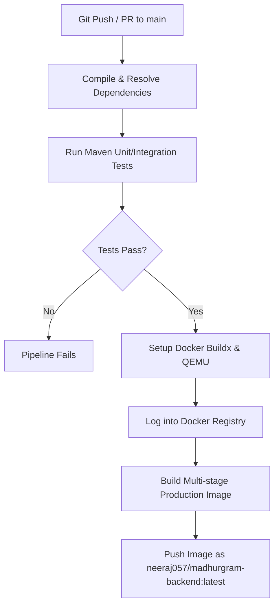

# Feature Documentation: Docker Containerization, Kubernetes Orchestration & CI/CD Pipeline

## 1. Overview
This documentation details the containerization, local orchestration, production Kubernetes deployment, and automated delivery pipeline (CI/CD) architecture for MadhurGram. These configurations transform the backend into a high-availability, auto-scalable, and resilient system capable of handling high concurrent traffic peaks with zero-downtime rolling updates.

---

## 2. Containerization: Docker & docker-compose

### A. Multi-Stage Dockerfile
The backend application is containerized using [Dockerfile](file:///d:/MadhurGram/product-service/Dockerfile) with a two-stage build architecture to minimize the deployment size and reduce vulnerabilities:
- **Build Stage**: Runs on `maven:3.9.6-eclipse-temurin-21-alpine`. It copies `pom.xml` and downloads Maven dependencies to cache them in Docker layers (`mvn dependency:go-offline`). Next, it copies the source code and packages the application JAR.
- **Runtime Stage**: Runs on a lightweight JRE environment `eclipse-temurin:21-jre-alpine`. For security best practices, a dedicated non-privileged user `spring:spring` is created to execute the jar inside the container.

### B. Multi-Container Compose Orchestration
The local development environment is orchestrated using [docker-compose.yml](file:///d:/MadhurGram/product-service/docker-compose.yml), linking:
1. `mysql-db`: MySQL 8.0 server mapping container volumes (`mysql-data`) for persistent database storage.
2. `redis-cache`: Redis Alpine container configured for fast key-value in-memory lookups.
3. `product-service`: Backend Spring Boot app.
- **Boot Order & Healthchecks**: The Spring Boot backend depends on both database and cache healthchecks. It will wait (`condition: service_healthy`) until MySQL and Redis are fully online before initiating its boot sequence to prevent boot connection timeouts.

---

## 3. Production Deployment: Kubernetes Cluster Manifests

All manifests are configured in the [k8s/](file:///d:/MadhurGram/product-service/k8s/) directory:

### A. Storage & Secret Configuration (`mysql-deployment.yaml`)
- **PersistentVolumeClaim (PVC)**: Allocates `5Gi` of persistent storage (`mysql-pvc`) to store database tables safely.
- **Secrets Management**: Stores MySQL root credentials securely as a Kubernetes `Secret`.

### B. High Availability & Probes (`app-deployment.yaml`)
- **Replica Configuration**: Bootstraps `replicas: 2` across different worker nodes to ensure high availability.
- **Liveness & Readiness Probes**:
  - `readinessProbe`: Hits `/api/public/products` after 20 seconds to confirm the pod is ready to serve database traffic before including it in the Service load balancer.
  - `livenessProbe`: Periodically hits `/api/public/products` every 15 seconds. If database connections hang or the JVM locks, Kubernetes restarts the pod automatically.
- **Network Routing**: A `LoadBalancer` service routes public traffic on port `8080` to backend pods.

### C. Auto-Scaling Engine (`app-hpa.yaml`)
Enables the Horizontal Pod Autoscaler (HPA):
- **Range**: Scales dynamic replicas from **2 to 10 pods**.
- **Metric Target**: Triggers scaling when average CPU utilization across active pods exceeds **70%**.

---

## 4. Automated CI/CD Pipeline (GitHub Actions)

The workflow file [.github/workflows/ci-cd.yml](file:///d:/MadhurGram/product-service/.github/workflows/ci-cd.yml) automates tests and packaging:



### Setup Requirements
Add the following secrets to your GitHub Repository Settings (`Settings -> Secrets and variables -> Actions`):
- `DOCKERHUB_USERNAME`: Your DockerHub account username.
- `DOCKERHUB_TOKEN`: Personal access token generated from your DockerHub profile settings.

---

## 5. Testing & Verification Protocols (स्टेप-बाय-स्टेप टेस्टिंग गाइड)

यहाँ प्रत्येक कंपोनेंट को टेस्ट और वैलिडेट करने के लिए आवश्यक कमांड्स और स्टेप्स की सूची दी गई है:

### A. Testing Local Docker Containerization (लोकल डॉकर टेस्टिंग)
यदि आप केवल बैकएंड एप्लिकेशन का एक अलग डॉकर इमेज बनाकर टेस्ट करना चाहते हैं:
1. टर्मिनल में प्रोजेक्ट के रूट फोल्डर पर जाएं।
2. इमेज बिल्ड करने के लिए यह कमांड चलाएं:
   ```bash
   docker build -t madhurgram-backend:test .
   ```
3. इमेज सफलतापूर्वक बनने के बाद, निम्न कमांड से चेक करें कि इमेज स्टोर में सेव हुई या नहीं:
   ```bash
   docker images
   ```

### B. Testing Multi-Container docker-compose Orchestration
1. **कंटेनर्स शुरू करें (Start Containers):**
   सभी सेवाओं (App, Database, Cache) को एक साथ बूट करने के लिए बैकग्राउंड मोड में चलाएं:
   ```bash
   docker-compose up --build -d
   ```
2. **कंटेनर की स्थिति देखें (Check Status):**
   यह चेक करने के लिए कि क्या तीनों कंटेनर्स सही तरीके से बूट हुए हैं और "Up/Healthy" स्टेट में हैं:
   ```bash
   docker-compose ps
   ```
   *आउटपुट में `madhurgram-mysql`, `madhurgram-redis`, और `madhurgram-backend-app` सभी Healthy दिखने चाहिए।*
3. **लॉग्स की निगरानी (Monitor Logs):**
   यदि बूटिंग के समय कोई एरर देखना हो या डेटाबेस कनेक्शन सिंक का लॉग देखना हो:
   ```bash
   docker-compose logs -f product-service
   ```
4. **एपीआई टेस्टिंग (API Testing):**
   ब्राउज़र या Postman में यह यूआरएल हिट करें:
   ```text
   http://localhost:8080/api/public/products
   ```
   *यह आपको डेटाबेस से सभी एक्टिव प्रोडक्ट्स की सूची JSON फॉर्मेट में रिटर्न करना चाहिए।*
5. **सफाई (Cleanup):**
   कंटेनर्स को रोकने और नेटवर्क/वॉल्यूम को पूरी तरह साफ़ करने के लिए:
   ```bash
   docker-compose down -v
   ```

### C. Testing Kubernetes Manifests (कुबेरनेटीस टेस्टिंग)
1. **लोकल ड्राई रन (Client Dry-Run):**
   सभी क्रेडेंशियल्स और स्ट्रक्चर को बिना क्लस्टर से कनेक्ट किए चेक करने के लिए:
   ```bash
   kubectl apply -f k8s/ --dry-run=client --validate=false
   ```
   *अगर सभी फ़ाइलें `created (dry run)` दिखाती हैं, तो स्कीमा बिल्कुल सही है।*
2. **क्लस्टर पर डिप्लॉय करना (Deploy to Active Cluster):**
   स्थानीय Kubernetes (Minikube या Docker Desktop Kubernetes) चालू होने पर डिप्लॉय करें:
   ```bash
   kubectl apply -f k8s/
   ```
3. **स्थिति जांचना (Verify Pods, Services, and HPA):**
   - **Pods की स्थिति:** `kubectl get pods` (दो बैकएंड पॉड्स, एक MySQL और एक Redis पॉड रनिंग स्टेट में दिखेंगे)।
   - **Services की स्थिति:** `kubectl get svc` (यहाँ `app-service` का External IP या LoadBalancer उपलब्ध दिखेगा)।
   - **Auto-Scaler (HPA) की स्थिति:** `kubectl get hpa` (यहाँ मिनिमम 2, मैक्सिमम 10 और CPU लिमिट 70% दिखाई देगी)।

### D. Testing GitHub Actions CI/CD Pipeline
1. अपना नया कोड कमिट करें और गिटहब पर पुश करें:
   ```bash
   git add .
   git commit -m "Configure docker and kubernetes setup"
   git push origin main
   ```
2. अपने GitHub Repository में जाएं और **Actions** टैब पर क्लिक करें।
3. वहां `MadhurGram Product Service CI-CD Pipeline` नाम का वर्कफ़्लो रन होता हुआ दिखेगा।
4. वर्कफ़्लो पर क्लिक करके **Build & Test** और **Build & Push Docker Image** जॉब्स के लाइव कंसोल लॉग्स को देखें और पुष्टि करें कि सारे टेस्ट पास हो रहे हैं।

