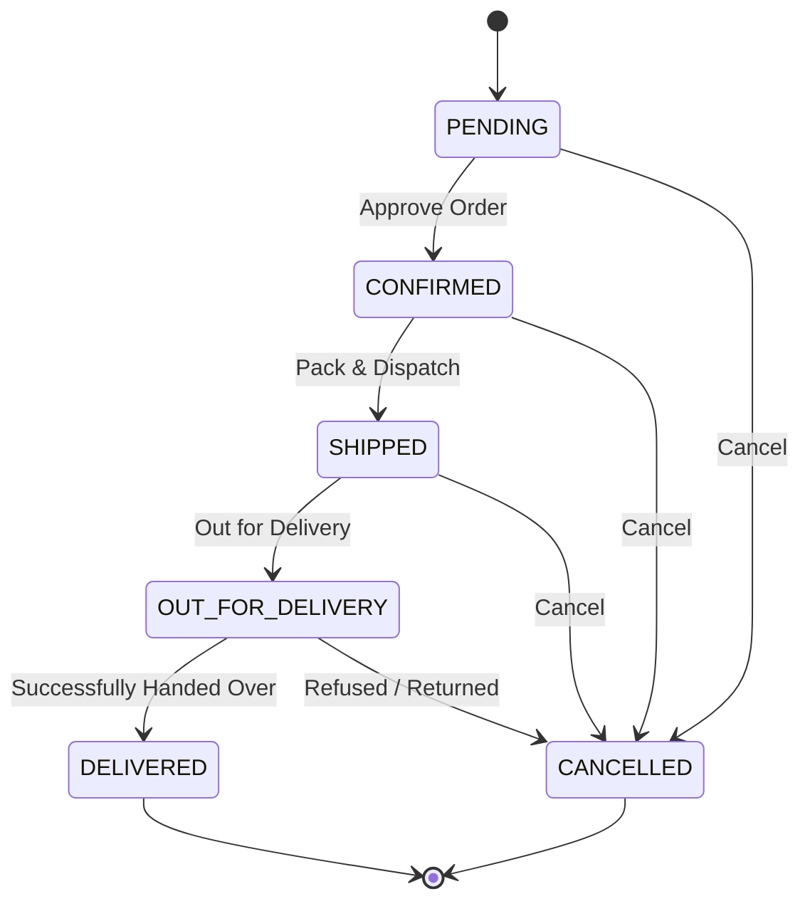

# Feature Documentation: Order Lifecycle, Notifications, & Analytics Dashboard

## 1. Overview
The order lifecycle and analytics features elevate the backoffice administration of MadhurGram to a production-grade enterprise platform. It enforces a strict order workflow to prevent stock/logistic tracking errors, dispatches automated status updates directly to customer WhatsApp threads, and renders a live, lightweight analytical dashboard showing key conversion metrics and sales timelines.

---

## 2. Order Status Lifecycle State Machine

### A. The Sequential Transition Path
The state machine ensures that order processing steps cannot be bypassed or skipped. This prevents operational errors (e.g. marking an order as `DELIVERED` before it is even `CONFIRMED` or `SHIPPED`).



### B. Transition Rules Logic
The transition constraints are defined inside [OrderStatus.java](file:///d:/MadhurGram/product-service/src/main/java/com/madhurgram/productservice/order/entity/OrderStatus.java):
```java
public boolean isValidTransition(OrderStatus nextStatus) {
    return switch (this) {
        case PENDING -> nextStatus == CONFIRMED || nextStatus == CANCELLED;
        case CONFIRMED -> nextStatus == SHIPPED || nextStatus == CANCELLED;
        case SHIPPED -> nextStatus == OUT_FOR_DELIVERY || nextStatus == CANCELLED;
        case OUT_FOR_DELIVERY -> nextStatus == DELIVERED || nextStatus == CANCELLED;
        case DELIVERED, CANCELLED -> false;
    };
}
```

### C. Automatic Stock Restoration
If an order is cancelled at any stage prior to delivery (`PENDING`, `CONFIRMED`, `SHIPPED`, or `OUT_FOR_DELIVERY`), the backend automatically loops through the order items and restores the deducted inventory in the database, protecting warehouse stocks.

---

## 3. Actionable WhatsApp Notification Bridge

Whenever an order's status is successfully updated, [OrderNotificationService](file:///d:/MadhurGram/product-service/src/main/java/com/madhurgram/productservice/order/service/OrderNotificationService.java) is triggered. It formats custom messages and sends them via the `TwilioService`.

### Notification Templates
- **CONFIRMED**:
  > *"नमस्ते [CustomerName]! आपका MadhurGram ऑर्डर (ID: MG-000[OrderID]) कन्फर्म हो गया है। हम इसे जल्द ही पैक करके शिप करेंगे। धन्यवाद, टीम MadhurGram 💛"*
- **SHIPPED**:
  > *"नमस्ते [CustomerName]! आपका MadhurGram ऑर्डर (ID: MG-000[OrderID]) शिप हो गया है। आपका ट्रैकिंग लिंक: http://localhost:3000/orders/track/[OrderID] है। धन्यवाद, टीम MadhurGram 💛"*
- **OUT_FOR_DELIVERY**:
  > *"नमस्ते [CustomerName]! आपका MadhurGram ऑर्डर (ID: MG-000[OrderID]) आउट फॉर डिलीवरी है। हमारा डिलीवरी पार्टनर जल्द ही आपसे संपर्क करेगा। धन्यवाद, टीम MadhurGram 💛"*
- **DELIVERED**:
  > *"नमस्ते [CustomerName]! आपका MadhurGram ऑर्डर (ID: MG-000[OrderID]) सफलतापूर्वक डिलीवर हो गया है। हमें आशा है कि आपको हमारे शुद्ध उत्पाद पसंद आएंगे। कृपया अपना फीडबैक यहाँ दें: http://localhost:3000/feedback। धन्यवाद, टीम MadhurGram 💛"*
- **CANCELLED**:
  > *"नमस्ते [CustomerName]! आपका MadhurGram ऑर्डर (ID: MG-000[OrderID]) कैंसिल कर दिया गया है। यदि आपने एडवांस पेमेंट किया था, तो रिफंड 3-5 दिनों में प्रोसेस हो जाएगा। धन्यवाद, टीम MadhurGram 💛"*

---

## 4. Real-Time Analytics & Revenue Trend Timeline

The live dashboard aggregates critical business health stats dynamically:

### A. Checkout-to-Order Conversion Rate
The conversion rate represents the effectiveness of the checkout flow:
$$\text{Conversion Rate} = \frac{\text{Total Recovered Abandoned Carts}}{\text{Total Checkout Sessions Initiated}} \times 100$$
This is fetched via `abandonedCartRepository` counts.

### B. Last 7 Days Revenue Timeline
To remain database-independent and avoid complex database timezone translations, the backend:
1. Fetches all orders from the last 7 days (`LocalDate.now().minusDays(6)` to `LocalDate.now()`).
2. Filters out `CANCELLED` orders.
3. Groups and sums totals by date in Java memory using `Collectors.groupingBy()`.
4. Seqeuntially fills in data points for all days (assigning `0` to days with no transactions) to ensure the frontend renders a continuous timeline.

### C. Lightweight SVG Chart Renderer
Instead of loading heavy, version-dependent third-party charting libraries, the frontend [AnalyticsGrid.tsx](file:///c:/Users/victus/madhurgram-frontend/src/components/features/admin/AnalyticsGrid.tsx) renders a custom **SVG Bar Chart**:
- Auto-scales heights based on the maximum daily revenue in the timeline.
- Styled with golden gradient fills (`#D4AF37`) matching the village sweetness theme.
- Features hover highlights displaying precise revenue totals on mouse overlay.

---

## 5. API Contracts

### A. Update Order Status
- **Endpoint**: `/api/orders/{id}/status`
- **Method**: `PATCH`
- **Query Parameter**: `status` (e.g. `CONFIRMED`)
- **Headers**: JWT Bearer Auth (Admin)
- **Response (`200 OK`)**: Returns the updated `Order` JSON.

### B. Fetch Live Dashboard Metrics
- **Endpoint**: `/api/admin/analytics/daily`
- **Method**: `GET`
- **Headers**: JWT Bearer Auth (Admin)
- **Response (`200 OK`)**:
  ```json
  {
    "todayRevenue": 2498.00,
    "todayOrderCount": 2,
    "pendingOrderCount": 4,
    "lowStockProductCount": 1,
    "conversionRate": 25.0,
    "revenueGraph": [
      { "date": "2026-06-29", "revenue": 0.0 },
      { "date": "2026-06-30", "revenue": 1490.0 },
      { "date": "2026-07-01", "revenue": 0.0 },
      { "date": "2026-07-02", "revenue": 590.0 },
      { "date": "2026-07-03", "revenue": 3990.0 },
      { "date": "2026-07-04", "revenue": 0.0 },
      { "date": "2026-07-05", "revenue": 2498.0 }
    ]
  }
  ```
