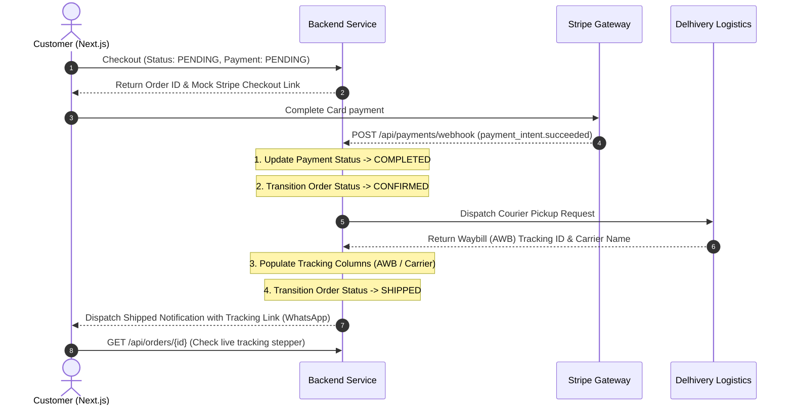

# Feature Documentation: Payments & Logistics Ecosystem Integration

## 1. Overview
The Payments and Logistics Integration connects MadhurGram to automated payment processors (such as Stripe or Razorpay) and logistics handlers (such as Delhivery or Shiprocket). 

By using secure Webhook event hooks, order validation is automated. When a transaction succeeds, the system allocates inventory and automatically schedules courier pickups without requiring manual administrative intervention.

---

## 2. Dynamic Workflow Architecture



---

## 3. Database Schema Mapping

The following attributes have been added to the `orders` database table to track transaction states and logistics manifests:

| Entity Attribute | Database Column | Data Type | Description |
| :--- | :--- | :--- | :--- |
| `paymentStatus` | `payment_status` | `VARCHAR(30)` | Status of payment transaction (`PENDING`, `COMPLETED`, `FAILED`). |
| `paymentTransactionId` | `payment_transaction_id` | `VARCHAR(100)` | Transaction reference code sent by Stripe/Razorpay. |
| `trackingNumber` | `tracking_number` | `VARCHAR(50)` | Waybill (AWB) number generated by Delhivery/Shiprocket. |
| `courierName` | `courier_name` | `VARCHAR(100)` | Shipping company name (e.g. `Delhivery Express`). |

---

## 4. Integration Specifications

### A. Webhook Endpoint (`PaymentController.java`)
- **Endpoint**: `POST /api/payments/webhook`
- **Payload Event Structure**:
  ```json
  {
    "type": "payment_intent.succeeded",
    "data": {
      "orderId": 12,
      "transactionId": "ch_stripe_mock_99182",
      "amount": 2490.00
    }
  }
  ```
- **Events Supported**:
  - `payment_intent.succeeded`: Automatically updates order payment status to `COMPLETED` and changes order status to `CONFIRMED`.
  - `payment_intent.failed`: Updates order payment status to `FAILED`, cancels the order, and automatically releases stock back to product inventory.

### B. Courier Pickup Engine (`LogisticsService.java`)
- **Action Trigger**: Executes synchronously/asynchronously once an order status shifts to `CONFIRMED`.
- **API Simulation**:
  - Automatically queries mock logistics API.
  - Generates AWB (e.g. `AWB-DELHIVERY-XXXXXXXXXX`).
  - Sets order status to `SHIPPED`.
  - Dispatches tracking WhatsApp template containing active tracking links:
    `http://localhost:3000/orders/track/{orderId}`

---

## 5. Live Tracking Frontend Stepper

The customer tracking screen is located at `/orders/track/[id]/page.tsx`:
- **Real-Time Stepper**: Renders status benchmarks (`Placed` ➔ `Paid` ➔ `Shipped` ➔ `Out for Delivery` ➔ `Delivered`) dynamically based on `orderStatus` and `paymentStatus`.
- **Action Retry Webhook Button**: If the payment fails (status `FAILED`), the UI renders a gold **"Retry Stripe/Razorpay Payment"** action button. Clicking this button sends a simulated success hook to the backend webhook in real-time, completing the transaction and updating the tracker state.
