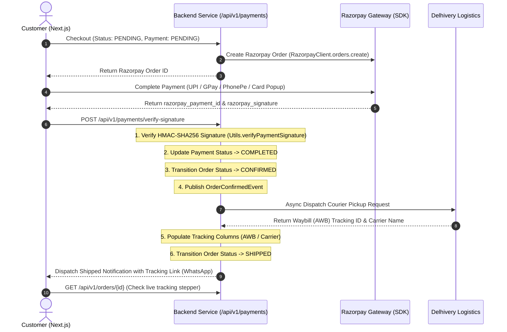

# Feature Documentation: Payments & Logistics Ecosystem Integration

## 1. Overview
The Payments and Logistics Integration connects MadhurGram to automated Indian payment processors (with **Razorpay** as the primary default gateway, and Stripe support) and logistics handlers (such as Delhivery or Shiprocket). 

By using secure HMAC-SHA256 Webhook hooks and Client Signature Verification (`/api/v1/payments/verify-signature`), order validation is automated. When a payment succeeds, the system allocates inventory and automatically schedules courier pickups via Spring ApplicationEvents without requiring manual administrative intervention.

---

## 2. Dynamic Workflow Architecture



---

## 3. Database Schema Mapping

The following attributes track transaction states and logistics manifests in the `orders` database table:

| Entity Attribute | Database Column | Data Type | Description |
| :--- | :--- | :--- | :--- |
| `paymentStatus` | `payment_status` | `VARCHAR(30)` | Status of payment transaction (`PENDING`, `COMPLETED`, `FAILED`, `COD`). |
| `paymentTransactionId` | `payment_transaction_id` | `VARCHAR(100)` | Transaction reference code sent by Razorpay/Stripe (e.g. `pay_P1x...`). |
| `trackingNumber` | `tracking_number` | `VARCHAR(50)` | Waybill (AWB) number generated by Delhivery/Shiprocket. |
| `courierName` | `courier_name` | `VARCHAR(100)` | Shipping company name (e.g. `Delhivery Express`). |

---

## 4. Integration Specifications

### A. Payment Endpoints (`PaymentController.java`)
- **Base Path**: `/api/v1/payments`
- **Endpoints**:
  - `POST /api/v1/payments/create-session/{orderId}`: Generates a Razorpay Order session via `RazorpayClient`.
  - `POST /api/v1/payments/verify-signature`: Verifies client checkout popup HMAC-SHA256 signature and confirms order.
  - `POST /api/v1/payments/webhook`: Handles asynchronous gateway webhook events.
- **Payload Structure (`/webhook`)**:
  ```json
  {
    "type": "payment_intent.succeeded",
    "data": {
      "orderId": 12,
      "transactionId": "pay_rzp_mock_99182",
      "amount": 2490.00
    }
  }
  ```
- **Events Supported**:
  - `payment_intent.succeeded`: Automatically updates order payment status to `COMPLETED` and changes order status to `CONFIRMED`.
  - `payment_intent.failed`: Updates order payment status to `FAILED`, cancels the order, and automatically releases stock back to product inventory.

### B. Courier Pickup Engine (`LogisticsService.java`)
- **Action Trigger**: Executes synchronously/asynchronously once an order status shifts to `CONFIRMED`.
- **API Simulation**:
  - Automatically queries mock logistics API.
  - Generates AWB (e.g. `AWB-DELHIVERY-XXXXXXXXXX`).
  - Sets order status to `SHIPPED`.
  - Dispatches tracking WhatsApp template containing active tracking links:
    `http://localhost:3000/orders/track/{orderId}`

---

## 5. Live Tracking Frontend Stepper

The customer tracking screen is located at `/orders/track/[id]/page.tsx`:
- **Real-Time Stepper**: Renders status benchmarks (`Placed` ➔ `Paid` ➔ `Shipped` ➔ `Out for Delivery` ➔ `Delivered`) dynamically based on `orderStatus` and `paymentStatus`.
- **Action Retry Webhook Button**: If the payment fails (status `FAILED`), the UI renders a gold **"Retry Razorpay Payment"** action button. Clicking this button sends a simulated success hook to the backend webhook (`/api/v1/payments/webhook`) in real-time, completing the transaction and updating the tracker state.

---

## 6. Production Readiness (Transitioning to Real Razorpay Checkout)

Currently, in development mode, the checkout flow utilizes a **Simulated Interactive Payment Gateway** to emulate UPI (PhonePe, GPay, Paytm) and Card payments. 

To go live in production and enable the actual Razorpay checkout modal (popup), the following changes are required:

### A. Environment Configuration
Update your `.env.local` (frontend) and `application.yml` / `.env` (backend) to include real Razorpay API keys:
- **Frontend**: `NEXT_PUBLIC_RAZORPAY_KEY_ID=rzp_live_your_production_key_here`
- **Backend**: 
  - `razorpay.key.id=rzp_live_your_production_key_here`
  - `razorpay.key.secret=your_production_secret_here`

*Note: The frontend `CheckoutModal.tsx` automatically detects real keys (starting with `rzp_live_` or `rzp_test_`) and triggers the official Razorpay JS Checkout SDK instead of the simulator.*

### B. Webhook Setup
In the Razorpay Dashboard (Settings > Webhooks):
1. Add a new Webhook URL pointing to your production server: `https://api.madhurgram.com/api/v1/payments/webhook`
2. Select the required events:
   - `order.paid`
   - `payment.failed`
3. Add a Webhook Secret and update your backend configuration to use this secret for webhook signature verification.

### C. Domain Whitelisting
Ensure that your production domain (`https://madhurgram.com`) is whitelisted in the Razorpay Dashboard for API requests and Checkout iframe integrations.
