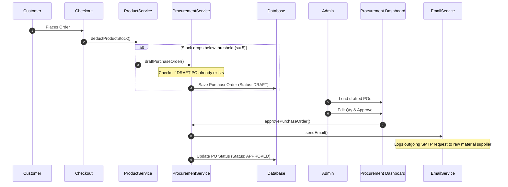
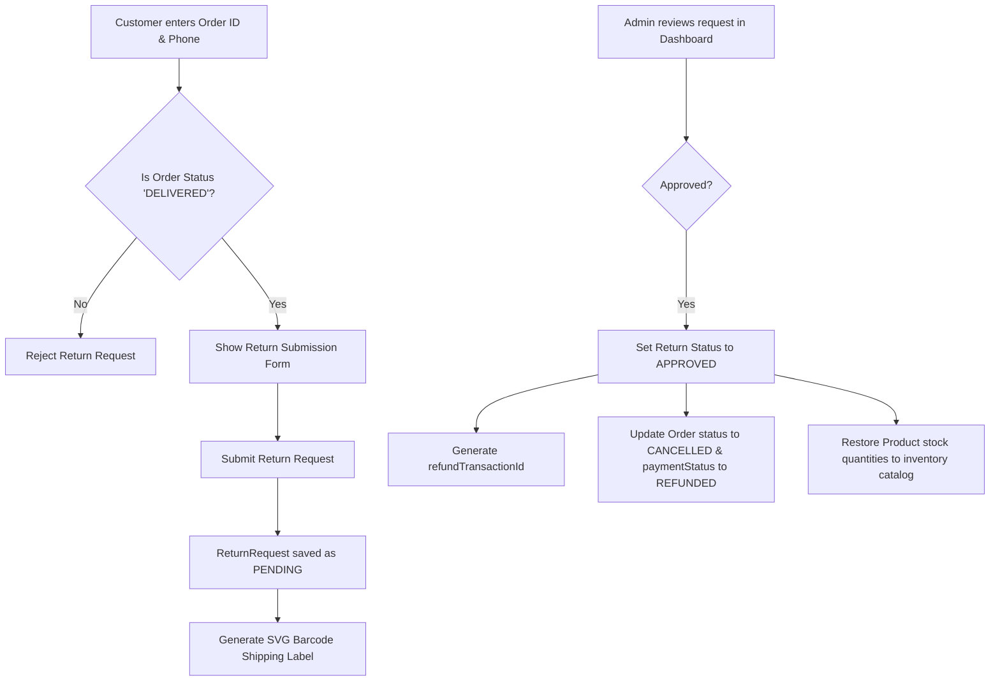
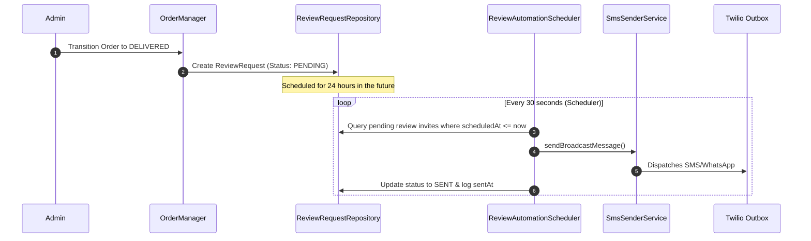

# MadhurGram Enterprise Automation — Technical & QA Documentation

This document provides a comprehensive technical overview and QA testing guide for the three newly implemented automation systems on the MadhurGram platform:
1. **Inventory-to-Production Sync (PO Drafting)**
2. **Self-Service Customer Return Portal & Refund Automation**
3. **Google Review reputation Engine (WhatsApp/SMS Solicitation)**

---

## 1. Inventory-to-Production Sync (PO Drafting)

### 1.1 Business Rationale
Manual stock check and purchase order management are prone to human errors, causing stockouts of popular batches (such as *A2 Cow Ghee*). This engine closes the loop by automatically drafting Purchase Orders (POs) when stock levels fall below critical thresholds, preventing lost sales and securing the supply chain.

### 1.2 Technical Architecture & Triggers


### 1.3 Database Schema (`purchase_orders` table)
| Column Name | Data Type | Constraint / Description |
| :--- | :--- | :--- |
| `id` | `BIGINT` | Primary Key, Auto-increment |
| `product_id` | `BIGINT` | Foreign Key referencing `products.id` |
| `quantity` | `INT` | Quantity requested for restock (Default: 50) |
| `supplier_name` | `VARCHAR(150)` | Vendor name (Default: Gopiganj Traditional Co.) |
| `supplier_email` | `VARCHAR(150)` | Vendor email address |
| `status` | `VARCHAR(30)` | Restock status: `DRAFT`, `APPROVED` |
| `created_at` | `DATETIME` | Timestamp when draft was auto-created |
| `approved_at` | `DATETIME` | Timestamp when Admin approved the PO |

### 1.4 REST API Endpoints
* **`GET /api/admin/procurement/pos`**: Lists all PO records sorted by date descending.
* **`PUT /api/admin/procurement/pos/{id}`**: Updates quantity, supplier name, and email for a drafted PO.
* **`POST /api/admin/procurement/pos/{id}/approve`**: Transition status to `APPROVED` and dispatches the simulated restock email to the vendor.

### 1.5 QA Testing Instructions
1. **Triggering PO Draft**:
   - Locate a product (e.g. *Badam Jaggery*) in the DB/Admin products catalog and set its stock to `6`.
   - File a mock checkout order for `2` units of this product.
   - Verify the catalog stock is now `4`.
   - Visit the Admin Procurement Console (`/admin/procurement`) and confirm that a new yellow badge entry **PO-XXXXX** is listed for this product with a default quantity of `50`.
2. **Updating PO Draft**:
   - On the draft row, click the edit icon.
   - Update quantity to `100` and vendor email to `rawmaterials@madhurgram.com`.
   - Click the green save tick. Verify that the table updates successfully.
3. **PO Approval & Supplier Email**:
   - Click the **"Approve & PO"** button.
   - Check the backend console logs. Verify that a block similar to the one below is logged, proving the simulated outgoing SMTP email was dispatched:
     ```text
     📧 [EMAIL TRANSMISSION SERVICE] (SIMULATED OUTGOING SMTP)
     To      : rawmaterials@madhurgram.com
     Subject : [APPROVED RESTOCK REQUEST] MadhurGram PO Ref: PO-00001
     Message : Dear Gopiganj Traditional Co., Please accept this approved Purchase Order...
     ```

---

## 2. Self-Service Return Portal & Refund Automation

### 2.1 Business Rationale
A manual return process is slow, resource-heavy, and lowers customer trust. By providing a Self-Service Return Portal, customers can instantly lookup orders, request returns, download pre-paid shipping labels, and track refund ledgers, while the system manages inventory restocking and cancels orders automatically on approval.

### 2.2 Technical Flow


### 2.3 Database Schema (`return_requests` table)
| Column Name | Data Type | Constraint / Description |
| :--- | :--- | :--- |
| `id` | `BIGINT` | Primary Key, Auto-increment |
| `order_id` | `BIGINT` | Unique Order reference mapping |
| `customer_phone` | `VARCHAR(15) ` | Normalized sender contact |
| `reason` | `VARCHAR(500)` | Client-selected return category & commentary |
| `status` | `VARCHAR(30)` | Return status: `PENDING`, `APPROVED`, `REJECTED` |
| `refund_transaction_id`| `VARCHAR(100)`| Automated UPI refund transaction reference |
| `created_at` | `DATETIME` | Timestamp when return request was filed |
| `approved_at` | `DATETIME` | Timestamp when return request was approved |

### 2.4 REST API Endpoints
* **`POST /api/returns`**: Customer submits return request (requires `orderId`, `phone`, `reason`).
* **`GET /api/returns/order/{orderId}`**: Fetches return request status for a specific order.
* **`GET /api/returns/label/{id}`**: Streams vector printable shipping label SVG (Content-Type: `image/svg+xml`).
* **`GET /api/returns/admin/all`**: Admin retrieves all filed return requests.
* **`POST /api/returns/admin/{id}/approve`**: Approves return request, triggers refund ledger update, cancels order, and restores catalog stocks.

### 2.5 QA Testing Instructions
1. **Filing a Customer Return Request**:
   - Place an order, pay, and transition the order status to `DELIVERED` via the Admin Live Orders tab.
   - Go to `/returns` on the customer frontend.
   - Input the Order ID and matching Phone Number. Click **"Lookup Order"**.
   - Select a reason (e.g. *Wrong volume/item delivered*) and write a short explanation.
   - Click **"Request Return & Generate Label"**.
   - Verify that a confirmation card appears showing:
     - Return Status: PENDING (Amber)
     - Prepaid Shipping Label preview containing tracking codes and India Post return addresses.
2. **Reviewing and Approving a Return (Refund Trigger)**:
   - Login to the Admin Dashboard and go to the **Returns Portal** tab.
   - You should see the newly requested return in the queue marked as `Pending Audit`.
   - Click **"Approve & Refund"**.
   - Check order status: Verify the order status transitions to `CANCELLED` and payment status transitions to `REFUNDED` on the order ledger.
   - Check product stock: Confirm that the product quantities from the returned order have been successfully added back (restored) to the product catalog stock.
   - Re-visit customer portal `/returns`: Verify the return status is now `APPROVED` and shows the generated ledger transaction ID (e.g., `REFUND-UPI-XXXXXX`).

---

## 3. Google Review Automation (Reputation Engine)

### 3.1 Business Rationale
Positive customer reviews on Google Business Profile directly increase local search visibility and conversions. This automation schedules review solicitations automatically after delivery, eliminating the need to manually ask customers for feedback.

### 3.2 Reputation Engine Flow


### 3.3 Database Schema (`review_requests` table)
| Column Name | Data Type | Constraint / Description |
| :--- | :--- | :--- |
| `id` | `BIGINT` | Primary Key, Auto-increment |
| `order_id` | `BIGINT` | Unique Order reference mapping |
| `customer_name` | `VARCHAR(150)` | Client name for template personalisation |
| `customer_phone` | `VARCHAR(15)` | Client contact phone |
| `status` | `VARCHAR(30)` | Invitation status: `PENDING`, `SENT`, `FAILED` |
| `scheduled_at` | `DATETIME` | Target send time (Order Delivery Time + 24 hours) |
| `sent_at` | `DATETIME` | Time when review invite was dispatched |

### 3.4 REST API Endpoints
* **`GET /api/admin/marketing/reviews`**: Returns scheduled campaigns list.
* **`GET /api/admin/marketing/reviews/config`**: Get configured Google Places rating URL.
* **`PUT /api/admin/marketing/reviews/config`**: Updates Google Place review URL template.
* **`POST /api/admin/marketing/reviews/{id}/send-now`**: Forces immediate dispatch of a scheduled pending request (bypasses 24h timer).
* **`POST /api/admin/marketing/reviews/send-test`**: Generates and dispatches a test invite immediately for name and phone parameters.

### 3.5 QA Testing Instructions
1. **Automatic Scheduling on Delivery**:
   - Go to Admin Live Orders and mark a confirmed order as `DELIVERED`.
   - Go to Admin Marketing and inspect the **Invitation Logs Queue**.
   - Verify that a new entry for this customer has been scheduled with a send timestamp set exactly 24 hours from now.
2. **Instant Dispatch (For Demos & Debugging)**:
   - In the table row of the pending invitation, click the **"Send Now"** button.
   - Verify that the status instantly transitions to `SENT` and logs the current send timestamp.
   - Check the backend console logs; confirm the Twilio SMS transmission log prints successfully.
3. **Manual Test Invitation Form**:
   - In the left panel of the Reputation dashboard, enter your custom test name and phone number.
   - Click **"Send Test Invite"**.
   - Verify the invitation registers, executes immediately, and appears in the log queue.
