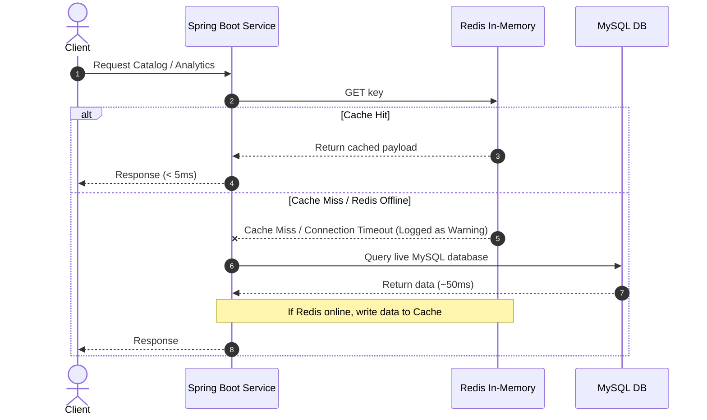

# Feature Documentation: Resilient Redis Caching & Speed Engine

## 1. Overview
The Redis Caching mechanism (the "Speed Engine") accelerates catalog read queries and heavy analytics reports on MadhurGram. By leveraging in-memory caching, the system reduces database query response times from typical database latency (~50ms) to in-memory lookup speeds (<5ms).

To prevent application startup failures or request errors in environments where Redis is not active (such as local developer machines), this implementation features a **Resilient Caching Bypass Handler** that automatically routes requests back to MySQL upon cache connection issues.

---

## 2. Architecture: Cache-Aside Pattern



---

## 3. Resilient Fallback Engine

Spring's default caching mechanism throws runtime connection errors if Redis becomes unreachable. We implement `CachingConfigurer` inside [CacheConfig.java](file:///d:/MadhurGram/product-service/src/main/java/com/madhurgram/productservice/config/CacheConfig.java) to catch these exceptions:

```java
@Configuration
@EnableCaching
public class CacheConfig implements CachingConfigurer {
    @Override
    public CacheErrorHandler errorHandler() {
        return new CacheErrorHandler() {
            @Override
            public void handleCacheGetError(RuntimeException e, Cache cache, Object key) {
                log.warn("Redis GET failed for key '{}' in cache '{}'. Bypassing to DB. Error: {}", key, cache.getName(), e.getMessage());
            }
            // Similar catch blocks for handleCachePutError, handleCacheEvictError, and handleCacheClearError
        };
    }
}
```

---

## 4. Cache Keys & Eviction Strategy

We define two caching zones:
1. `products`: Stores the active catalog and category listings.
2. `analytics`: Stores the admin dashboard report payload.

| Cache Name | Key | Cache Target | Eviction Trigger (Evicts All Entries) |
| :--- | :--- | :--- | :--- |
| `products` | `'active'` | `getAllActiveProducts()` | Add / Update / Delete Product (Admin), Stock Deduction / Restoration |
| `products` | `'{categoryName}'` | `getProductsByCategory(category)` | Add / Update / Delete Product (Admin), Stock Deduction / Restoration |
| `products` | `'public_active'` | `getAllActiveProductsForPublic()` | Add / Update / Delete Product (Admin), Stock Deduction / Restoration |
| `analytics` | `'daily'` | `getDailyDashboardMetrics()` | New order placement, status updates, stock deduction, cart updates, or cart recovery |

---

## 5. Setup & Environment Configurations

### A. Maven Dependencies
```xml
<dependency>
    <groupId>org.springframework.boot</groupId>
    <artifactId>spring-boot-starter-data-redis</artifactId>
</dependency>
```

### B. Configuration Properties
Configured in [application.properties](file:///d:/MadhurGram/product-service/src/main/resources/application.properties):
```properties
# Redis Cache Settings
spring.data.redis.host=${REDIS_HOST:localhost}
spring.data.redis.port=${REDIS_PORT:6379}
```
If deploying to staging or production, set the environment variables `REDIS_HOST` and `REDIS_PORT` to connect to cloud or containerized Redis instances.
