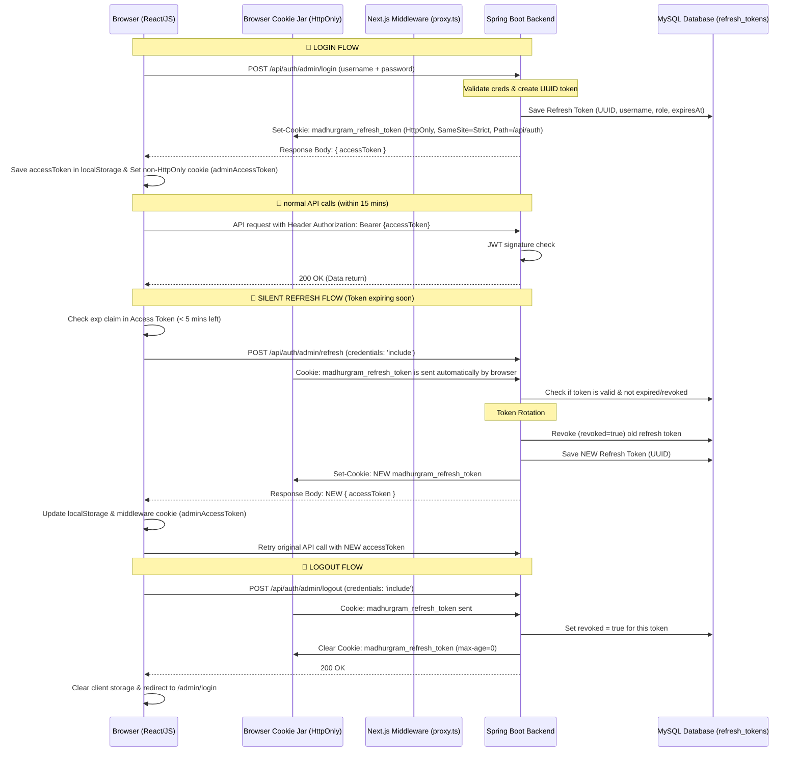

# 🔒 MadhurGram Admin Auth Architecture (Production-Grade Setup)

Bhai, ye document humare naye **Access Token + Refresh Token (with Rotation & Revocation)** system ka pura kacha-chittha hai. Agar koi naya dev team me aaye ya fir deployment ke time security audit ho, toh ye doc sab clear kar dega. Pura Hinglish me likha hai taaki sab aasani se samajh sakein. 🚀

---

## 🧐 Problem Kya Thi? (Why did we build this?)

Pehle kya ho raha tha:
1. **Token Expiry Ka Jhol:** Backend JWT token 1 ghante (`3600000ms`) me expire ho jata tha, lekin frontend pe cookie 10 ghante tak valid rehti thi.
2. **Session Expire/Login Redirect:** Jab bhi admin page ko 1-2 ghante khula chhod kar wapas aate the, access token expire ho chuka hota tha. Jaise hi koi API call hoti thi, backend `401 Unauthorized` de deta tha aur user direct login page par fake ho jata tha (error ke saath).
3. **XSS Vulnerability:** Admin token `localStorage` me stored tha. Agar site par koi XSS (Cross-Site Scripting) attack hota, toh hacker easily token chura sakta tha kyunki JavaScript `localStorage` ko access kar sakti hai.

---

## 💡 Real Life Example (Samajhne Ke Liye)

Socho aap ek premium club (MadhurGram Admin Panel) me enter kar rahe ho:
* **Pehle ka system (Only Access Token):** Gate par aapko ek entry band mila jo 1 ghante me expire ho jata hai. Agar aap 1 ghante se zyada andar rahe, toh security guard aapko bina pooche dhakke maar ke nikal deta tha, bhale hi aap club ke trusted member ho. Dobara line me lago (Login karo).
* **Naya System (Access + Refresh Token):** 
  * **Access Token (Pass Band):** Ye sirf **15 minutes** ke liye valid hai. Aapke haath me bandha hai.
  * **Refresh Token (Identity Card):** Ye aapke pocket me ek locked wallet me rakha hai (is locked wallet ko JavaScript touch nahi kar sakti — ye **HttpOnly Cookie** hai).
  * **Silent Refresh:** Jab pass band (Access Token) expire hone wala hota hai (10 mins chalne ke baad), aap bina club ke bahar gaye pocket se ID card nikalte ho aur gatekeeper ko dikha kar naya pass band le lete ho. Aur safety ke liye gatekeeper aapka purana ID card le kar naya card de deta hai (**Token Rotation**). 
  * Agar aapko club se nikalna hai, toh card cancel ho jata hai (**Logout/Revocation**).

---

## 🏗️ Architecture Overview

Ye diagram dikhata hai ki client (browser), middleware, backend server aur MySQL database aapas me kaise communicate karte hain:

---

## 🛠️ Detailed Flow Discussion

### 1. Login Flow (Dual Token Setup)
* User admin credentials enter karta hai.
* Backend credentials check karta hai. Agar valid hai, toh:
  1. Ek short-lived JWT **Access Token** banata hai (15 minutes expiry) jisme user ka roles (`ROLE_SUPER_ADMIN` ya `ROLE_SUPPORT_STAFF`) encoded hai.
  2. Ek random UUID string generate karta hai jo **Refresh Token** banega, aur usko MySQL DB me save karta hai (`refresh_tokens` table me).
  3. Response body me `{ accessToken: "..." }` bhejta hai.
  4. Response headers me `Set-Cookie` bhejta hai jiske andar Refresh Token hota hai. Cookie ke attributes:
     * `HttpOnly`: Taki React ya JS ise read na kar sake (XSS se full safety).
     * `SameSite=Strict`: Taki CSRF attacks se protection mile.
     * `Path=/api/auth`: Ye cookie sirf auth endpoints pe hi send hogi, baaki API requests pe faaltu me bandwidth waste nahi karegi.
     * `Secure`: (Prod settings me) Taki sirf HTTPS connections pe hi transmit ho.

### 2. Silent Token Refresh Flow
* Humare frontend ke `apiClient.ts` me request send hone se pehle ek pre-request check lagaya hai.
* Agar active Access Token 5 minute se kam time me expire hone wala hai:
  * ApiClient automatically background me `POST /api/auth/admin/refresh` ko call karega.
  * Hum use karte hain `credentials: "include"`, isse browser automatically humari HttpOnly refresh token cookie backend ko send kar deta hai.
  * Backend database me check karta hai: Kya ye token valid hai? Expired toh nahi hua? Revoked toh nahi hai?
  * **Token Rotation (Security Masterstroke):** Agar token valid hai, toh backend us token ko usi waqt *revoke* (invalidate) kar deta hai, aur ek naya refresh token bana kar DB me save kar deta hai aur user ko naya access token + refresh cookie de deta hai.
  * *Faida:* Agar by chance kisi hacker ne refresh token chura bhi liya, toh rotation ki wajah se jab naya login ya refresh hoga, purana token conflict ho jayega aur backend poora session block kar dega.
  * Refresh hone ke baad original API call naye Access Token ke saath aage badh jaati hai. User ko pata bhi nahi chalta!

### 3. Logout Flow (Revocation)
* Logout par browser database me stored refresh token ko revoke (sets `revoked = true`) kar deta hai.
* HttpOnly cookie ko browser se delete kar diya jata hai (Set `max-age = 0`).
* Client side storage (`localStorage`) se access token saaf kar diya jata hai.
* Iske baad agar koi hacker purane access token se 15 minute ke andar access karna chahe toh jab tak wo valid hai (max 15 mins) tabhi tak kar payega, lekin refresh kabhi nahi kar payega kyunki DB me refresh token destroy ho chuka hai.

---

## 📂 File-wise Implementation Details

Humne system me ye files banayi aur change ki hain:

### Backend (Java/Spring Boot)
1. **[RefreshToken.java](file:///d:/MadhurGram/product-service/src/main/java/com/madhurgram/productservice/auth/entity/RefreshToken.java):** Database entity class. SQL table ka naam `refresh_tokens` hai. Isme indexes hain `token` aur `username` pe for ultra-fast DB query performance.
2. **[RefreshTokenRepository.java](file:///d:/MadhurGram/product-service/src/main/java/com/madhurgram/productservice/auth/repository/RefreshTokenRepository.java):** Custom database queries handle karne ke liye repository.
3. **[RefreshTokenService.java](file:///d:/MadhurGram/product-service/src/main/java/com/madhurgram/productservice/auth/service/RefreshTokenService.java):** 
   * `validateAndRotate()`: Purana token check karke usko revoke karta hai aur new token save karta hai.
   * `cleanupExpiredTokens()`: Har **6 ghante** me ek scheduled job chalti hai database me se saare purane/expired tokens ko delete karne ke liye (DB size optimize karne ke liye).
4. **[AuthController.java](file:///d:/MadhurGram/product-service/src/main/java/com/madhurgram/productservice/auth/controller/AuthController.java):** Naye endpoints register kiye: `/admin/login`, `/admin/refresh` (cookie check aur rotation ke sath), `/admin/logout`.
5. **[JwtAuthenticationFilter.java](file:///d:/MadhurGram/product-service/src/main/java/com/madhurgram/productservice/security/JwtAuthenticationFilter.java):** Isme `shouldNotFilter()` lagaya hai taaki jab user refresh karne aaye ya logout kare, toh expired authorization header filters ko block na kare (kyunki refresh call cookie pe depend karti hai header pe nahi).
6. **[application.properties](file:///d:/MadhurGram/product-service/src/main/resources/application.properties):** Default tokens timeouts define kare: `jwt.expiration-ms` to 15 min (`900000ms`), `jwt.refresh-expiration-days` to `7`.

### Frontend (Next.js/React)
1. **[constants.ts](file:///c:/Users/victus/madhurgram-frontend/src/utils/constants.ts):** Expiry values updates kiye aur token key ka naam update kiya.
2. **[adminAuth.ts](file:///c:/Users/victus/madhurgram-frontend/src/utils/adminAuth.ts):** Silent refresh logic likhi. Ek background timer add kiya jo har 60 seconds me check karta hai. Agar admin tab khula chhod kar chala gaya, toh active tab background me token refresh karta rahega jab tak session close nahi hota.
3. **[apiClient.ts](file:///c:/Users/victus/madhurgram-frontend/src/apis/apiClient.ts):** Custom fetch client me `credentials: "include"` attach kiya. Iske bina cookies transfer nahi hoti hain.
4. **[login/page.tsx](file:///c:/Users/victus/madhurgram-frontend/src/app/admin/login/page.tsx):** Login ke response me ab token ki jagah `accessToken` extract karta hai aur security headers ke liye credentials pass karta hai.

---

## 🔒 Production Deployment Checklist

Jab is system ko actual server pe deploy karoge, toh in baaton ka dhyan rakhna:

1. **`madhurgram.cookie.secure` Variable:** Dev environment me we run on `http://localhost`, isliye secure cookie feature disabled hota hai. Production deployment par application properties me ise `true` kar dena (ya `COOKIE_SECURE=true` env set karna). HTTPS must be active!
2. **CORS Configuration:** Java security filter me frontend ka live domain approved hona chahiye (`SecurityConfig.java` line 50), tabhi cross-origin requests pe credentials (cookies) save hongi.
3. **Cookie Domain:** Frontend aur API server dono agar same parent domain pe hain (e.g. `madhurgram.com` aur `api.madhurgram.com`), toh `SameSite=Strict` and cookie sharing perfectly secure and fast chalegi.
